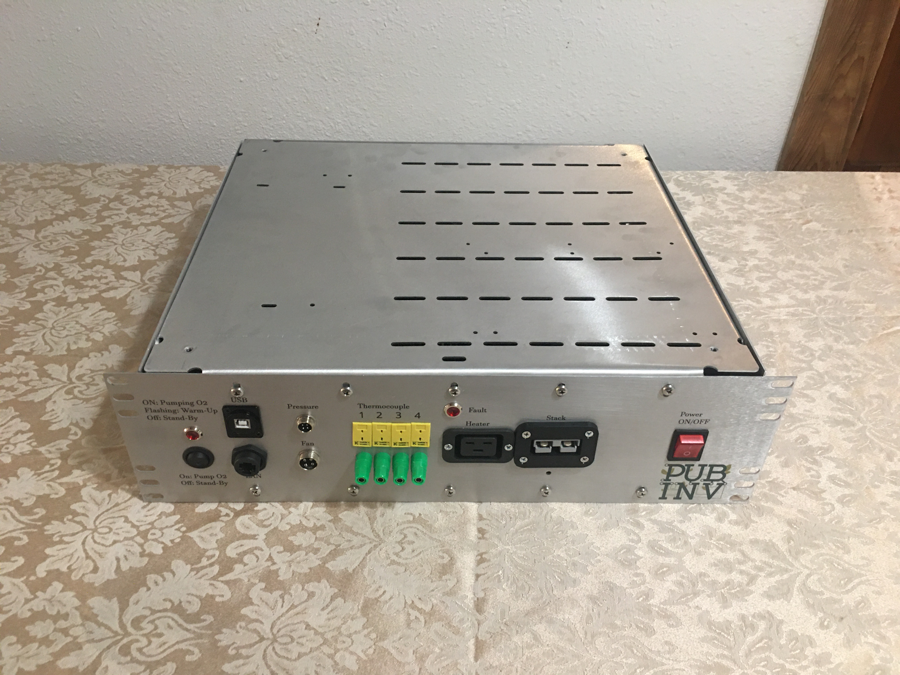

# 3U OEDCS Assembled
Photos of the October 2024 build of five OEDCS final assemblies.  
Front panels are REV1 which required extensive nibbeling of the SB50 flange.  

<a
href="FrontPanel.JPG">
  
Front view as assemblied. Click to enlarge </a>

<a
href="Back.JPGg">
  
Back view as assemblied. Click to enlarge </a>

<a
href="CablesInPlace.JPG">
  
Front view wtih cables. Click to enlarge </a>

<a
href="FrontFromTop.JPG">
  
Front from top view as assemblied. Click to enlarge </a>

<a
href="Oblique.JPG">
  
Oblique view as assemblied. Click to enlarge </a>

<a
href="Top.JPG">
  
Top view as assemblied. Click to enlarge </a>

<a
href="TopOblique.JPG">
  
Top oblique view as assemblied. Click to enlarge </a>

<a
href="PowerCloseUp.JPG">
  
Power connections detail view as assemblied. Click to enlarge </a>

<a
href="OEDCSInRack.JPG">
  
OEDCS in the travel rack. Click to enlarge </a>

<a
href="OEDCSShippingAndRack.JPG">
  
Overview of OEDCS in the travel rack wtih cover on. Click to enlarge </a>

