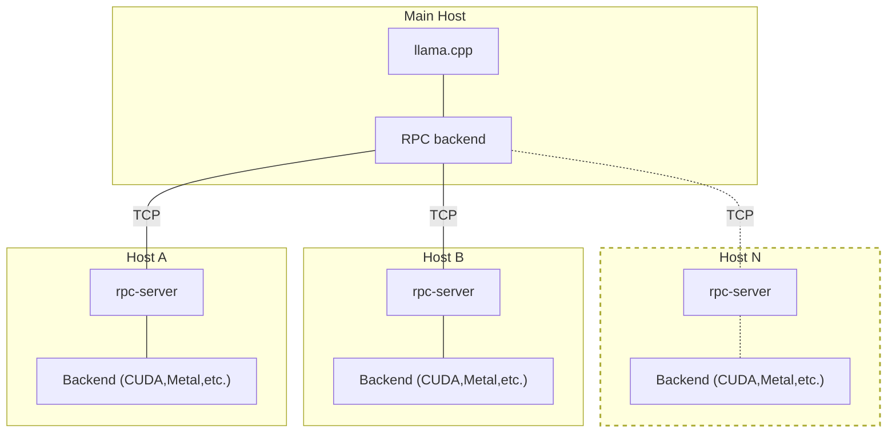

## Overview

The `Wiring Harness` diagrams allows for constructing cable harnesses to interconnect various components.
The BOM for the 'Wiring Harness' consists of all components needed to construct a wiring harness.
This can be used to construct a new O:

##  BOM

### Sub-Assemblies
#### Front Panel Assembly
##### Order of Assembly:
* 

#### Rear Panel Assembly
##### Order of Assembly:
* 

#### Base-Plate and Rails Assembly
##### Order of Assembly:
* Install C20 using two ''#6-32 x '¾ IN' flat philips screws.
* Add WH1 to panel mounted C20
* Install fan assembly

#### Top-Plate Assembly
##### Order of Assembly:
* 

## Order of Assembly
### Rails and side panel

